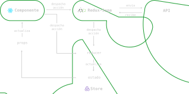

# Breaking Bad App

<br />


<br />

## Demo

[Link](https://guileless-syrniki-3de03d.netlify.app/)

<br />

## Instalación

```bash
npm install
```

<br />

## Ejecución

```bash
npm run dev
```

<br />

## Hecho con

- [TypeScript](https://www.typescriptlang.org/)
- [Vite](https://vitejs.dev)
- [Redux](https://es.redux.js.org/)
- [Redux-Saga](https://redux-saga.js.org/)
- [Jest](https://jestjs.io/es-ES/)
- [React Testing Library](https://testing-library.com/docs/react-testing-library/intro/)
- [Sass](https://sass-lang.com/)
- [i18next](https://www.i18next.com/)

<br />

# Estructura del proyecto

Este proyecto fue creado utilizando una estructura por tipo de fichero ya que es un proyecto sencillo, esta estructura permite hacer una separación entre los componentes y las vistas. Cada componente esta dentro de una carpeta con su respectivo nombre, estilos y tests, se aplica la misma estructura para los hooks.

## Estructura de carpetas

<br />

```
react-app/
├── src/
│   ├── components/
│   │   ├── CharacterCard/
│   │   ├── CharacterDescription/
│   │   ├── CharacterInfo/
│   │   ├── CharactersList/
│   │   ├── Footer/
│   │   ├── Layout/
│   │   ├── LoadingScreen/
│   │   ├── MainContainer/
│   │   ├── NavBar/
│   │   └── Paginator/
│   ├── hooks/
│   │   ├── useData/
│   │   ├── usePagination/
│   │   └── useTranslator/
│   ├── store/
│   │   ├── reducer/
│   │   └── sagas/
│   ├── globalStyles/
│   ├── routes/
│   ├── translations/
│   ├── types/
│   ├── utils/
│   ├── views/
│   ├── App.tsx
│   └── main.tsx
├── .babelrc
├── .eslintrc.cjs
├── .gitignore
├── .prettierrc
├── index.html
├── package.json
├── README.md
├── tsconfig.json
├── tsconfig.node.json
└── vite.config.ts

```

<br />

## Estructura de componentes

<br />

```
└─ src/
   ├── components/
   │   ├── CharacterCard/
   │   │   ├── CharacterCard.module.scss
   │   │   ├── CharacterCard.spec.tsx
   │   │   └── CharacterCard.tsx
```

<br />

## Estructura de hooks

<br />

```
└─ src/
   ├── hooks/
   │   ├── useData/
   │   │   ├── useData.spec.ts
   │   │   └── useData.tsx

```

# Arquitectura

Definire una arquitectura React-Redux. He decidido usar Redux para el manejo del estado y Redux-Saga como middleware para comunicarme con la API, Redux-Saga me permitira un mejor control de la comunicación asincrona y manejo de errores.

<br />



<br />

## Memorias

> 22/08/2022</br>
> Para esta aplicación usare Vite en lugar de Create React App, principalmente por dos razones, practicamente no necesita configuración y me permitira levantar un servidor de desarrollo de carga muy rapida ya que trabaja directamente con ES Modules. Tambien tiene soporte nativo para TypeScript.

> 22/08/2022</br>
> Inicio el desarrollo de la aplicación, iniciando Git en el directorio raiz
> e instalando las dependencias:

    - react-router-dom
    - eslint
    - prettier
    - redux
    - redux-saga
    - jest
    - sass

> 22/08/2022</br>
> Usare CSS modules para los estilos con Sass, con CSS modules se podran mantener los estilos aislados dentro de cada componente.

> 22/08/2022</br>
> Decido usar la configuracion "Standard" para Eslint haciendo uso de "eslint-config-prettier" para que no colisione con Prettier y lo configuro en el archivo eslintrc:

```
  extends: [
  'plugin:react/recommended',
  'standard-with-typescript',
  'prettier'
],
```

> 22/08/2022</br>
> Para el testing utilizare Jest y React Testing Library, ambas son las librerias que uso habitualmente, luego de completar la instalacion creo el archivo .babelrc y configuro los presets que me permitiran correr los tests de la siguiente manera:

```
{
  "presets": ["@babel/preset-env", ["@babel/preset-react", {
    "runtime": "automatic"
 }], "@babel/preset-typescript"]
}
```

> 22/08/2022</br>
> Defino los scripts para Eslint y Jest:

```
  "scripts": {
    ...
    "test": "jest",
    "test:watch": "npm test -- --watch",
    "lint": "eslint src/**/*.{ts,tsx}"
  },
```

> 23/08/2022</br>
> Ya creada la vista principal de la aplicación defino su ruta en el componente MainRoutes haciendo uso de React Router.

> 23/08/2022</br>
> Creo el store de la aplicacion con un único reducer y las sagas correspondientes.

```
└─ src/
   ├── store/
   │   ├── reducer/
   │   │   ├── actions/
   │   │   └── app.reducer.ts
   │   ├── sagas/
   │   └── store.ts

```

> 23/08/2022</br>
> He creado 3 custom hooks para despachar acciones y obtener los datos del estado: useData, usePagination y useTranslator, esto me va a permitir mantener los componentes mas compactos y faciles de leer.

```
└─ src/
   ├── hooks/
   │   ├── useData/
   │   ├── usePagination/
   │   └── useTranslator/

```

> 23/08/2022</br>
> Decido añadir paginación a la vista principal para poder tener disponible todos los personajes sin tener que hacer un solo fetch tan pesado que comprometa el rendimiento de la app y generar asi una mejor experiencia de usuario, tambien creo una animación de carga que se mostrara mientras los elementos aun no esten disponibles.

> 23/08/2022</br>
> Inicio la instalación y configuración de i18next para manejar el idioma de la aplicación. El idioma podra ser cambiado manualmente entre ingles y español desde la parte derecha del NavBar.

> 24/08/2022</br>
> Inicio la refactorización en base a los tests creados.

> 25/08/2022</br>
> Añado tests unitarios a los actions generators del store incluyendo el tipado.

</br>

## Test coverage

<pre>-------------------------------|---------|----------|---------|---------|-------------------
File                           | % Stmts | % Branch | % Funcs | % Lines | Uncovered Line #s 
-------------------------------|---------|----------|---------|---------|-------------------
<font color="#33D17A"><b>All files                     </b></font> | <font color="#33D17A"><b>  84.49</b></font> | <font color="#E9AD0C"><b>      72</b></font> | <font color="#33D17A"><b>  87.17</b></font> | <font color="#33D17A"><b>   84.8</b></font> | <font color="#F66151"><b>                 </b></font> 
<font color="#33D17A"><b> src                          </b></font> | <font color="#33D17A"><b>    100</b></font> | <font color="#33D17A"><b>     100</b></font> | <font color="#33D17A"><b>    100</b></font> | <font color="#33D17A"><b>    100</b></font> | <font color="#E9AD0C"><b>                 </b></font> 
<font color="#33D17A"><b>  i18n.ts                     </b></font> | <font color="#33D17A"><b>    100</b></font> | <font color="#33D17A"><b>     100</b></font> | <font color="#33D17A"><b>    100</b></font> | <font color="#33D17A"><b>    100</b></font> | <font color="#E9AD0C"><b>                 </b></font> 
<font color="#33D17A"><b> src/components/CharacterCard </b></font> | <font color="#33D17A"><b>     80</b></font> | <font color="#33D17A"><b>     100</b></font> | <font color="#E9AD0C"><b>     50</b></font> | <font color="#33D17A"><b>     80</b></font> | <font color="#F66151"><b>                 </b></font> 
<font color="#33D17A"><b>  CharacterCard.tsx           </b></font> | <font color="#33D17A"><b>     80</b></font> | <font color="#33D17A"><b>     100</b></font> | <font color="#E9AD0C"><b>     50</b></font> | <font color="#33D17A"><b>     80</b></font> | <font color="#F66151"><b>20               </b></font> 
<font color="#33D17A"><b> src/components/CharacterInfo </b></font> | <font color="#33D17A"><b>    100</b></font> | <font color="#E9AD0C"><b>      50</b></font> | <font color="#33D17A"><b>    100</b></font> | <font color="#33D17A"><b>    100</b></font> | <font color="#E9AD0C"><b>                 </b></font> 
<font color="#33D17A"><b>  CharacterInfo.tsx           </b></font> | <font color="#33D17A"><b>    100</b></font> | <font color="#E9AD0C"><b>      50</b></font> | <font color="#33D17A"><b>    100</b></font> | <font color="#33D17A"><b>    100</b></font> | <font color="#E9AD0C"><b>65               </b></font> 
<font color="#33D17A"><b> src/components/CharactersList</b></font> | <font color="#33D17A"><b>    100</b></font> | <font color="#33D17A"><b>     100</b></font> | <font color="#33D17A"><b>    100</b></font> | <font color="#33D17A"><b>    100</b></font> | <font color="#E9AD0C"><b>                 </b></font> 
<font color="#33D17A"><b>  CharactersList.tsx          </b></font> | <font color="#33D17A"><b>    100</b></font> | <font color="#33D17A"><b>     100</b></font> | <font color="#33D17A"><b>    100</b></font> | <font color="#33D17A"><b>    100</b></font> | <font color="#E9AD0C"><b>                 </b></font> 
<font color="#33D17A"><b> src/components/Footer        </b></font> | <font color="#33D17A"><b>    100</b></font> | <font color="#33D17A"><b>     100</b></font> | <font color="#33D17A"><b>    100</b></font> | <font color="#33D17A"><b>    100</b></font> | <font color="#E9AD0C"><b>                 </b></font> 
<font color="#33D17A"><b>  Footer.tsx                  </b></font> | <font color="#33D17A"><b>    100</b></font> | <font color="#33D17A"><b>     100</b></font> | <font color="#33D17A"><b>    100</b></font> | <font color="#33D17A"><b>    100</b></font> | <font color="#E9AD0C"><b>                 </b></font> 
<font color="#33D17A"><b> src/components/Layout        </b></font> | <font color="#33D17A"><b>    100</b></font> | <font color="#33D17A"><b>     100</b></font> | <font color="#33D17A"><b>    100</b></font> | <font color="#33D17A"><b>    100</b></font> | <font color="#E9AD0C"><b>                 </b></font> 
<font color="#33D17A"><b>  Layout.tsx                  </b></font> | <font color="#33D17A"><b>    100</b></font> | <font color="#33D17A"><b>     100</b></font> | <font color="#33D17A"><b>    100</b></font> | <font color="#33D17A"><b>    100</b></font> | <font color="#E9AD0C"><b>                 </b></font> 
<font color="#33D17A"><b> src/components/LoadingScreen </b></font> | <font color="#33D17A"><b>    100</b></font> | <font color="#33D17A"><b>     100</b></font> | <font color="#33D17A"><b>    100</b></font> | <font color="#33D17A"><b>    100</b></font> | <font color="#E9AD0C"><b>                 </b></font> 
<font color="#33D17A"><b>  LoadingScreen.tsx           </b></font> | <font color="#33D17A"><b>    100</b></font> | <font color="#33D17A"><b>     100</b></font> | <font color="#33D17A"><b>    100</b></font> | <font color="#33D17A"><b>    100</b></font> | <font color="#E9AD0C"><b>                 </b></font> 
<font color="#33D17A"><b> src/components/MainContainer </b></font> | <font color="#33D17A"><b>    100</b></font> | <font color="#33D17A"><b>     100</b></font> | <font color="#33D17A"><b>    100</b></font> | <font color="#33D17A"><b>    100</b></font> | <font color="#E9AD0C"><b>                 </b></font> 
<font color="#33D17A"><b>  MainContainer.tsx           </b></font> | <font color="#33D17A"><b>    100</b></font> | <font color="#33D17A"><b>     100</b></font> | <font color="#33D17A"><b>    100</b></font> | <font color="#33D17A"><b>    100</b></font> | <font color="#E9AD0C"><b>                 </b></font> 
<font color="#33D17A"><b> src/components/NavBar        </b></font> | <font color="#33D17A"><b>    100</b></font> | <font color="#33D17A"><b>     100</b></font> | <font color="#33D17A"><b>    100</b></font> | <font color="#33D17A"><b>    100</b></font> | <font color="#E9AD0C"><b>                 </b></font> 
<font color="#33D17A"><b>  NavBar.tsx                  </b></font> | <font color="#33D17A"><b>    100</b></font> | <font color="#33D17A"><b>     100</b></font> | <font color="#33D17A"><b>    100</b></font> | <font color="#33D17A"><b>    100</b></font> | <font color="#E9AD0C"><b>                 </b></font> 
<font color="#33D17A"><b> src/components/Paginator     </b></font> | <font color="#33D17A"><b>    100</b></font> | <font color="#E9AD0C"><b>      50</b></font> | <font color="#33D17A"><b>    100</b></font> | <font color="#33D17A"><b>    100</b></font> | <font color="#E9AD0C"><b>                 </b></font> 
<font color="#33D17A"><b>  Paginator.tsx               </b></font> | <font color="#33D17A"><b>    100</b></font> | <font color="#E9AD0C"><b>      50</b></font> | <font color="#33D17A"><b>    100</b></font> | <font color="#33D17A"><b>    100</b></font> | <font color="#E9AD0C"><b>25-37            </b></font> 
<font color="#33D17A"><b> src/hooks                    </b></font> | <font color="#33D17A"><b>     90</b></font> | <font color="#33D17A"><b>     100</b></font> | <font color="#E9AD0C"><b>     75</b></font> | <font color="#33D17A"><b>  94.44</b></font> | <font color="#F66151"><b>                 </b></font> 
<font color="#33D17A"><b>  useAppReducer.tsx           </b></font> | <font color="#33D17A"><b>     90</b></font> | <font color="#33D17A"><b>     100</b></font> | <font color="#E9AD0C"><b>     75</b></font> | <font color="#33D17A"><b>  94.44</b></font> | <font color="#F66151"><b>50               </b></font> 
<font color="#33D17A"><b> src/store                    </b></font> | <font color="#33D17A"><b>    100</b></font> | <font color="#33D17A"><b>     100</b></font> | <font color="#33D17A"><b>    100</b></font> | <font color="#33D17A"><b>    100</b></font> | <font color="#E9AD0C"><b>                 </b></font> 
<font color="#33D17A"><b>  store.ts                    </b></font> | <font color="#33D17A"><b>    100</b></font> | <font color="#33D17A"><b>     100</b></font> | <font color="#33D17A"><b>    100</b></font> | <font color="#33D17A"><b>    100</b></font> | <font color="#E9AD0C"><b>                 </b></font> 
<font color="#33D17A"><b> src/store/reducer            </b></font> | <font color="#33D17A"><b>     95</b></font> | <font color="#33D17A"><b>   81.81</b></font> | <font color="#33D17A"><b>    100</b></font> | <font color="#33D17A"><b>     95</b></font> | <font color="#F66151"><b>                 </b></font> 
<font color="#33D17A"><b>  actionTypes.ts              </b></font> | <font color="#33D17A"><b>    100</b></font> | <font color="#33D17A"><b>     100</b></font> | <font color="#33D17A"><b>    100</b></font> | <font color="#33D17A"><b>    100</b></font> | <font color="#E9AD0C"><b>                 </b></font> 
<font color="#33D17A"><b>  app.actions.ts              </b></font> | <font color="#33D17A"><b>    100</b></font> | <font color="#33D17A"><b>     100</b></font> | <font color="#33D17A"><b>    100</b></font> | <font color="#33D17A"><b>    100</b></font> | <font color="#E9AD0C"><b>                 </b></font> 
<font color="#33D17A"><b>  app.reducer.ts              </b></font> | <font color="#33D17A"><b>  84.61</b></font> | <font color="#33D17A"><b>   81.81</b></font> | <font color="#33D17A"><b>    100</b></font> | <font color="#33D17A"><b>  84.61</b></font> | <font color="#F66151"><b>44-46            </b></font> 
<font color="#F66151"><b> src/store/sagas              </b></font> | <font color="#F66151"><b>  38.09</b></font> | <font color="#F66151"><b>       0</b></font> | <font color="#E9AD0C"><b>     75</b></font> | <font color="#F66151"><b>     35</b></font> | <font color="#F66151"><b>                 </b></font> 
<font color="#F66151"><b>  appSaga.tsx                 </b></font> | <font color="#F66151"><b>  31.57</b></font> | <font color="#F66151"><b>       0</b></font> | <font color="#E9AD0C"><b>  66.66</b></font> | <font color="#F66151"><b>  31.57</b></font> | <font color="#F66151"><b>30-67            </b></font> 
<font color="#33D17A"><b>  selectors.ts                </b></font> | <font color="#33D17A"><b>    100</b></font> | <font color="#33D17A"><b>     100</b></font> | <font color="#33D17A"><b>    100</b></font> | <font color="#33D17A"><b>    100</b></font> | <font color="#E9AD0C"><b>                 </b></font> 
<font color="#33D17A"><b> src/utils                    </b></font> | <font color="#33D17A"><b>  88.23</b></font> | <font color="#33D17A"><b>     100</b></font> | <font color="#E9AD0C"><b>     75</b></font> | <font color="#33D17A"><b>   87.5</b></font> | <font color="#F66151"><b>                 </b></font> 
<font color="#33D17A"><b>  fetchData.ts                </b></font> | <font color="#33D17A"><b>  85.71</b></font> | <font color="#33D17A"><b>     100</b></font> | <font color="#33D17A"><b>    100</b></font> | <font color="#33D17A"><b>  85.71</b></font> | <font color="#F66151"><b>13               </b></font> 
<font color="#E9AD0C"><b>  functions.ts                </b></font> | <font color="#E9AD0C"><b>     75</b></font> | <font color="#33D17A"><b>     100</b></font> | <font color="#E9AD0C"><b>     50</b></font> | <font color="#E9AD0C"><b>  66.66</b></font> | <font color="#F66151"><b>2                </b></font> 
<font color="#33D17A"><b>  testingUtils.tsx            </b></font> | <font color="#33D17A"><b>    100</b></font> | <font color="#33D17A"><b>     100</b></font> | <font color="#33D17A"><b>    100</b></font> | <font color="#33D17A"><b>    100</b></font> | <font color="#E9AD0C"><b>                 </b></font> 
-------------------------------|---------|----------|---------|---------|-------------------

<b>Test Suites: </b><font color="#33D17A"><b>12 passed</b></font>, 12 total
<b>Tests:       </b><font color="#33D17A"><b>32 passed</b></font>, 32 total
<b>Snapshots:   </b>0 total
<b>Time:</b>        <font color="#E9AD0C"><b>6.518 s</b></font>
<font color="#717171">Ran all test suites.</font>
</pre>
